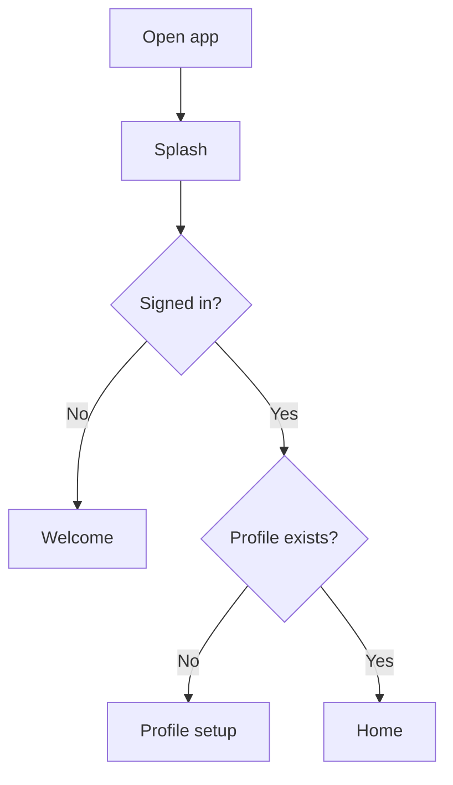
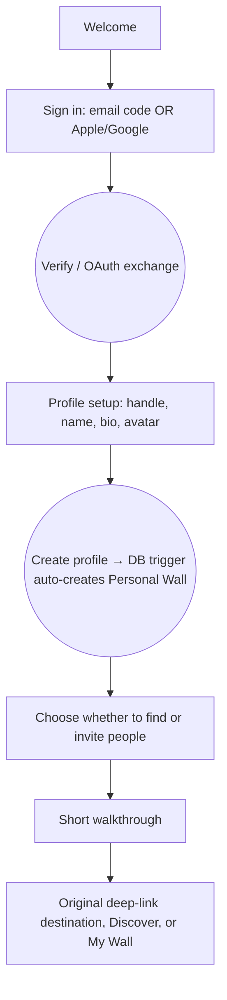
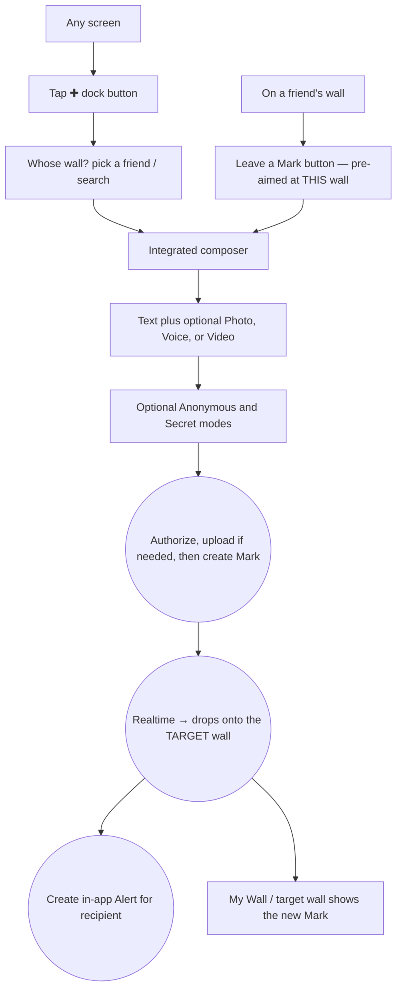
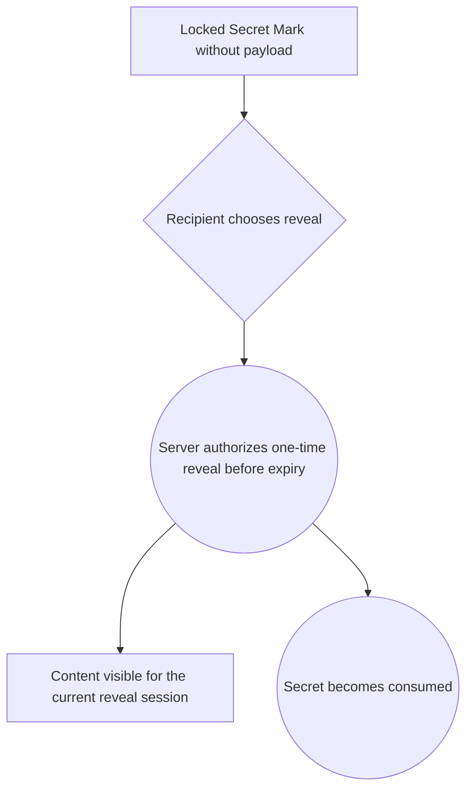
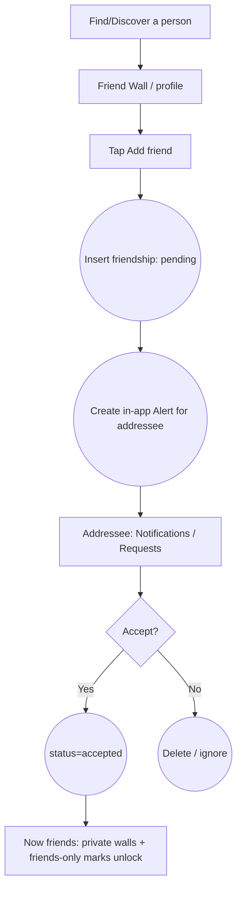
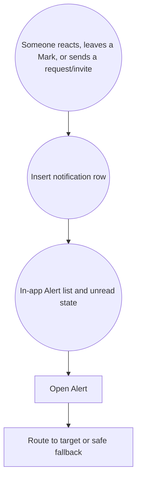

# 02 · User Flows

Step-by-step flows for every screen. Diagrams are Mermaid (render on GitHub).
Routes reference the Expo app under `app/`.

## Legend
- `[Screen]` = a route the user sees
- `{Decision}` = a branch
- `(( ))` = a background/system action (DB write, realtime, notification)

---

## 1. App entry & auth gate


Implemented in `app/index.tsx` (`useAuth` gate).

## 2. Onboarding (signed-out → ready account)


Legacy `about` and `interests` routes redirect into the approved activation flow.

## 3. Leave a Mark (the core loop — on SOMEONE ELSE'S wall)

The primary action targets another person's wall (see `01 · Core interaction
model`). Two entry points converge on the integrated composer; the target wall is always
chosen *before* writing, never defaulted to self.


The dock action opens the people picker; Wall actions open the same composer pre-aimed.

## 4. Secret reveal



## 6. Friend request



## 7. Moderation (approval + report)

```mermaid
flowchart TD
  subgraph Approval (wall requires approval)
    M1[Non-owner leaves mark] --> P1((status=pending))
    P1 --> Q[Owner: moderation queue]
    Q --> A1{Approve?}
    A1 -- Yes --> V1((status=active → appears))
    A1 -- No --> H1((status=hidden))
  end
  subgraph Report
    M2[Viewer opens a mark] --> R2[Report]
    R2 --> I2((Insert report))
    M2 --> H2[Owner/author: Hide]
  end
```

## 8. In-app Alerts



Native push may be added later, but it is not a first-implementation MVP requirement.

## 9. Explicit flow exclusions

Comments, games, and doodles have no MVP flow. Do not create placeholder navigation or dead-end
entries for them.
