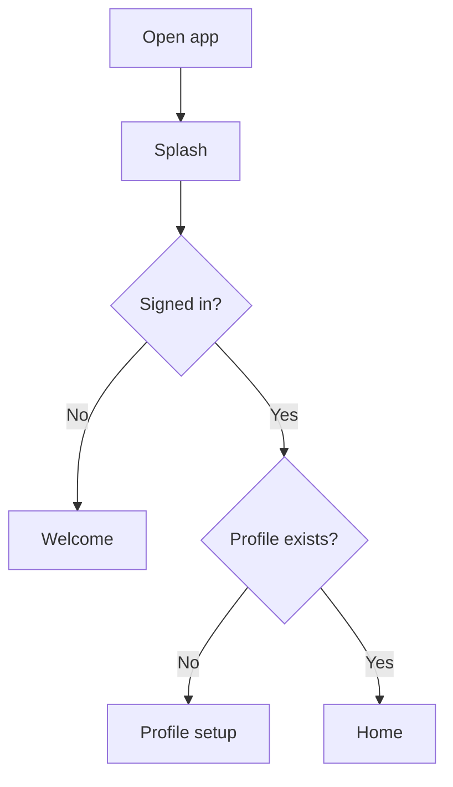
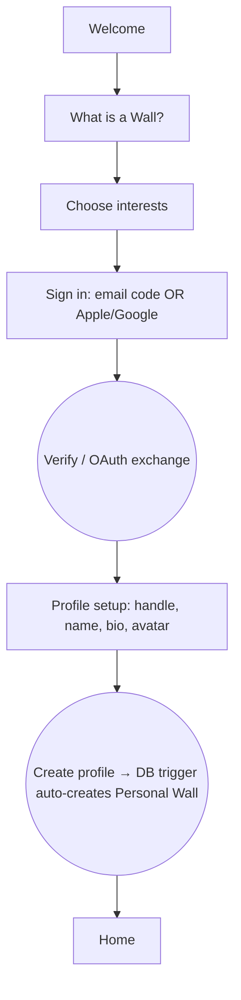
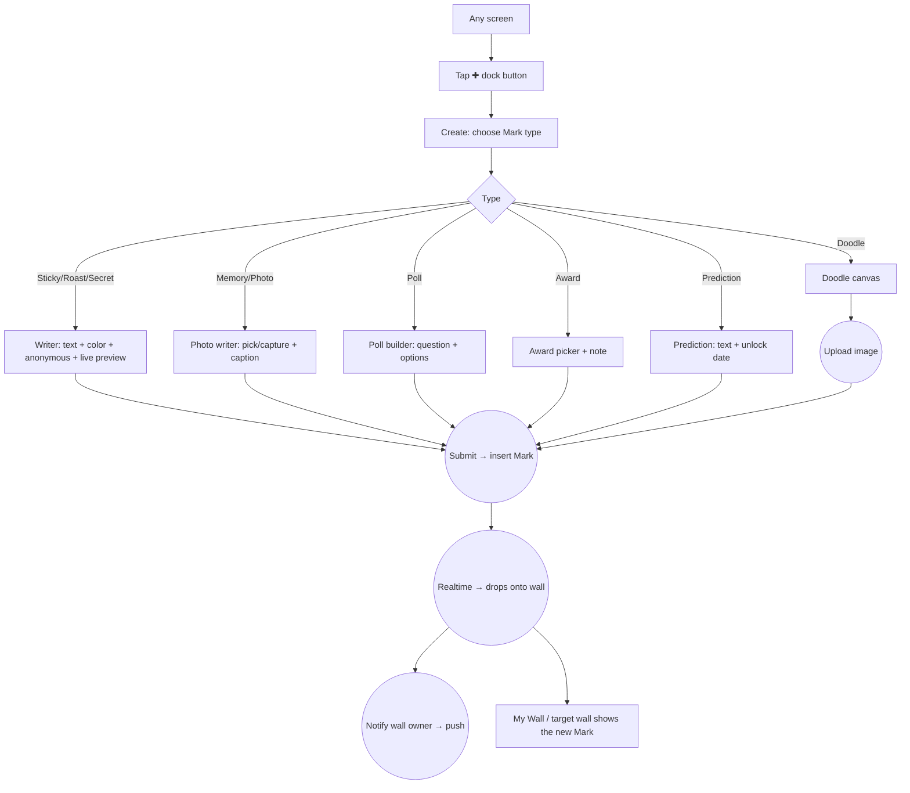
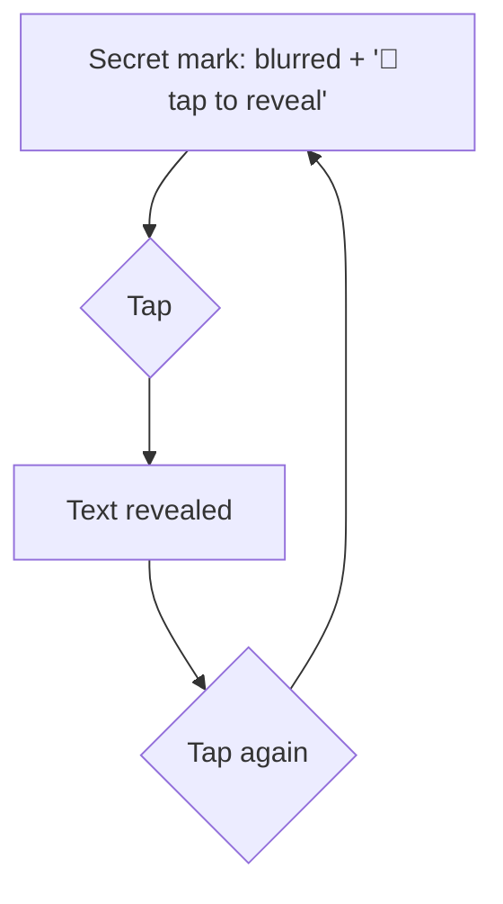
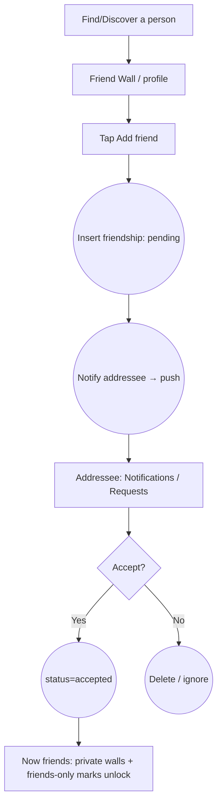
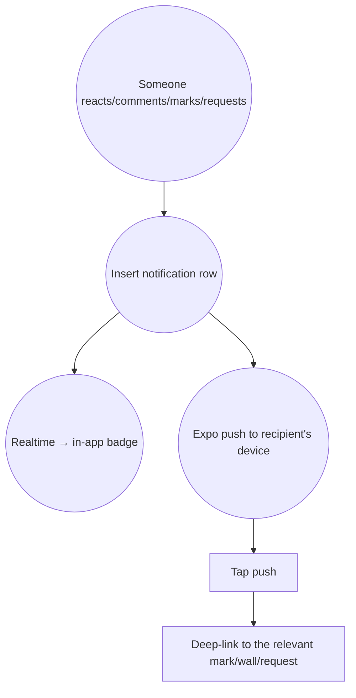

# 02 · User Flows

Step-by-step flows for every screen. Diagrams are Mermaid (render on GitHub).
Routes reference the Expo app under `app/`.

## Legend
- `[Screen]` = a route the user sees
- `{Decision}` = a branch
- `(( ))` = a background/system action (DB write, realtime, push)

---

## 1. App entry & auth gate


Implemented in `app/index.tsx` (`useAuth` gate).

## 2. Onboarding (signed-out → on your wall)


Routes: `(onboarding)/welcome`, `about`, `interests`, `sign-in`, `profile-setup`.

## 3. Leave a Mark (the core loop)


`✚` and Create exist; writers are the current build focus (`write/[type]`).

## 4. Secret reveal


Implemented in `MarkView` (`SecretMark`).

## 5. Prediction lifecycle

```mermaid
flowchart TD
  C[Author writes prediction + unlock date] --> L[🔒 Locked: shows 'unlocks {date}']
  L --> D{Now ≥ unlock date?}
  D -- No --> L
  D -- Yes --> U[🔮 Revealed: text shown]
```

## 6. Friend request



## 7. Moderation (approval + report)

```mermaid
flowchart TD
  subgraph Approval (wall requires approval)
    M1[Non-owner leaves mark] --> P1((status=pending))
    P1 --> Q[Owner: moderation queue]
    Q --> A1{Approve?}
    A1 -- Yes --> V1((status=active → appears))
    A1 -- No --> H1((status=hidden))
  end
  subgraph Report
    M2[Viewer opens a mark] --> R2[Report]
    R2 --> I2((Insert report))
    M2 --> H2[Owner/author: Hide]
  end
```

## 8. Notifications → push



## 9. Games (plugin entry)

```mermaid
flowchart TD
  H[Home / Games] --> R[Game registry lists available games]
  R --> S{Select game}
  S --> E[Game EntryScreen (plugin)]
  E --> PLAY[Play → scoring] --> REW((Reward hooks + analytics))
  REW --> BACK[Back to Home]
```
See games-as-plugins in `06_Tech_Architecture.md`.
