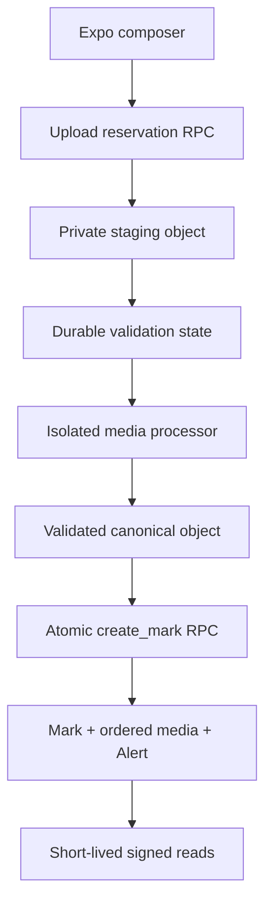
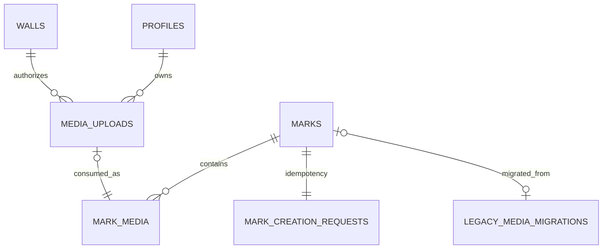

# FP-MEDIA-001: Protected private Mark media

**Status:** Approved — including independently Two-Key-approved worker credential protocol v2
**Decision:** [ADR-012](./ADR-012-protected-mark-media.md)
**Authority:** `THE_WALL_MASTER_BUILD_SPEC_v1.1.md` §§21–25, 62, 67–69, 81, 100, 108, 119–121; `P0_SECURITY_CONTRACT_PLAN.md` Package C
**Repository base:** `ab5539592e405c23cee49dbf02aeff1aa7e0dd0e`
**Prepared:** 2026-08-27
**Fast Lane:** High-Risk / Architectural; independent design review before implementation and Reviewer + QA/Security on exact implementation

## Executive summary

Package C restores non-Secret Photo, Voice, and Video Marks through a private, staged,
server-validated pipeline. The client first creates an authorized upload reservation, uploads to an
exact private staging path, waits for a trusted processor, and then calls one idempotent
`create_mark` RPC. The RPC creates the Mark, ordered media rows, upload consumption, Anonymous
provenance, Secret-text record, and Alert in one PostgreSQL transaction. Viewers receive only
short-lived signed URLs after current Mark access is rechecked.

Migration `0020` adds the foundation without removing the safe text compatibility writer.
`0021_media_worker_credentials.sql` additively binds the approved worker protocol v2. Migration
`0022_mark_creation_cutover.sql` is the final cutover after the client, processor, hosted Storage,
legacy migration, and tests pass. Rollback disables media; it never republishes private objects.

## Complexity estimate

| Dimension | Assessment |
|---|---|
| Tier | High-Risk / Architectural |
| Complexity | Complex: database + RLS + Storage + client + external decoder + migration |
| Rough effort | 8–12 focused AI implementation/review sessions plus device/hosted verification |
| Files affected | Approximately 25–40 across migrations, functions, worker, client, tests, CI, docs |
| Database impact | Additive `0020` + worker correction `0021`, later contract-cutover `0022`; no destructive table drop |
| Dependency risk | Medium/High: TUS client, pinned image/AV toolchain, one OCI runtime |
| Operational risk | High: user private media, service credentials, cleanup, legacy public data |
| Regulated-domain flag | Personal/private user media and potentially identifying metadata |

## Goals and non-goals

### Goals

- Restore Text/Photo/Voice/Video creation without public Mark URLs.
- Support 1–5 ordered Photo objects, one Voice object, or one Video object.
- Preserve full photo framing; sanitize metadata and unsafe encodings.
- Verify Voice `<=60s` and Video `<=30s` from bytes at a trusted boundary.
- Make creation atomic and idempotent across upload and network retries.
- Reauthorize each read and bound bearer-URL exposure.
- Migrate and prove removal of legacy public Mark media before claiming privacy.
- Give Backend, Frontend, DevOps, Reviewer, Security, and QA exact work units.

### Non-goals

- Secret Photo/Voice/Video. `secret=true` + media fails closed.
- Public Mark media optimization through a public bucket.
- Permanent signed URL storage or offline media downloads.
- Comments, polls, doodles, games, or new Mark types.
- End-to-end encryption or client-held media keys.
- A general-purpose asset platform; this pipeline is Mark-media-specific.

## Repository discovery findings

### Verified original state at planning base `ab55395` (historical)

- `HEAD` is the exact green base `ab55395`; migrations end at `0019`.
- `0018_p0_authorization_contract.sql` allows authenticated direct inserts only for canonical text
  with null `media_url`/`payload` and denies new `attachments/marks/*` writes.
- `src/lib/upload.ts` still implements the superseded public single-object upload contract.
- `src/lib/marks.ts#createMark` still directly inserts `marks` and sends client `media_url/payload`.
- `app/create.tsx` holds exactly one `MediaDraft`, clears Secret when media attaches, uses client
  duration, uploads first, then inserts a Mark.
- `MarkView` reads a single `marks.media_url`; Photo already uses `contentFit="contain"`.
- The schema has no `media_uploads`, `mark_media`, media job, or legacy migration ledger table.
- Existing triggers already provide contribution recheck, Anonymous true-author recording, Secret
  text extraction, initial status, and Alert creation around a `marks` insert.
- `0018` makes `wall_id`, `author_id`, `type`, `anonymous`, and `secret` immutable after creation.
- The task-supplied base is CI-green with 135 database checks; this docs-only pass did not re-run
  them. There are no hosted Storage API, processor, signed URL, or real media decoding tests.

The current protected-media worktree now contains `0020_mark_media_foundation.sql` and its C1 test
suite. That later implementation does not make the historical bullets above current claims; C1.1
must extend the existing migration contract through the separately ordered additive `0021` file.

### Existing decisions reconciled

- ADR-006/D-6 are superseded only for Mark media. Public avatars remain in `attachments`.
- Secret remains an orthogonal mode, but Package C supports Secret **text only**.
- Existing Anonymous and Alert triggers remain authoritative; `create_mark` must use them rather
  than creating parallel provenance or notification logic.
- Existing `marks.payload` is not the new metadata store. New media metadata lives in normalized
  server-trusted rows.

## System design



The database is the workflow source of truth. Storage object presence does not itself prove a safe
upload. The worker is trusted only for the attempt it has leased. The client never promotes state.

## Binding reviewer-closure specification

This section closes the independent review findings and overrides any less-specific wording later
in this plan. Backend must implement these boundaries literally; changing one requires Architect +
Security re-review.

### Default-off, server-side kind controls

Private table `media_kind_controls(kind PK, reservation_enabled, upload_transition_enabled,
processing_enabled, creation_enabled, updated_at, updated_by, reason)` has Photo, Voice, and Video
rows with every boolean `false` by default. No app grant, policy, Realtime publication, or client
flag may mutate it. Protected setters have a fixed search path, service-only execution, and audit.

| Boundary | Required server check |
|---|---|
| `begin_media_upload` | `reservation_enabled=true` before quota/reservation |
| staging Storage authorization and `mark_media_uploaded` | `upload_transition_enabled=true` both when bytes enter and when state changes |
| worker claim/dispatch | `processing_enabled=true`; disabling prevents new claims and invalidates undispatched envelopes |
| `create_mark` | `creation_enabled=true` for media kind inside the creation transaction |

Direct RPC/Data API tests must prove each disabled switch fails even when the mobile client flag is
forged on. The protected setter refuses `creation_enabled=true` unless the legacy reconciliation
singleton is complete. Incident rollback order is server creation off, processing off, transition
off, reservation off, then client flag off. Never reopen the public path.

### Exact workflow FKs, tombstones, and deletion outbox

`media_uploads` uses `uploader_id uuid NULL REFERENCES auth.users(id) ON DELETE SET NULL` plus
immutable non-null `uploader_tombstone_id`; `wall_id uuid NULL REFERENCES walls(id) ON DELETE SET
NULL` plus `wall_tombstone_id`; and `consumed_mark_id uuid NULL REFERENCES marks(id) ON DELETE SET
NULL` plus nullable-until-consumption `consumed_mark_tombstone_id`. Tombstones are populated before
the FK target can disappear and are never app-readable. `mark_media.mark_id` is `ON DELETE CASCADE`;
`mark_media.upload_id` is `ON DELETE RESTRICT` so an upload audit row cannot disappear under live
media. `mark_creation_requests.actor_id` is `ON DELETE CASCADE`; its nullable `mark_id` is `ON
DELETE SET NULL`, while non-null `result_mark_id` is a raw UUID tombstone once completed.

Private `media_object_deletions` has: `id`, `idempotency_key`, `bucket_id`, `object_path`,
`preview_path`, `reason`, `state(pending|processing|deleted|failed)`, `attempt_id`, `attempt_count`,
`lease_expires_at`, `object_deleted_at`, `preview_deleted_at`, `object_evidence jsonb`,
`preview_evidence jsonb`, `created_at`, and `updated_at`. It has no FK to a deletable user, Wall, or
Mark. A `BEFORE DELETE` trigger on `mark_media` enqueues the exact canonical and preview paths in
the same transaction before cascade deletes the relation. Staging expiry/failure and profile/
account cleanup enqueue source, validated, and preview paths before deleting related workflow
state. Exact-path uniqueness/idempotency prevents duplicate destructive work; wildcard deletion is
forbidden. The Storage-API worker treats 404 as idempotent success and records a fresh HEAD/missing
proof before `deleted`. Database evidence remains after object deletion.

Account deletion removes unconsumed drafts through the outbox. Media consumed by Marks on other
users' Walls remains for the Mark's retention policy; when a Mark or owned Wall is hard-deleted,
the `mark_media` trigger enqueues it. No database row containing the only object locator is erased
before the durable outbox row commits.

### Versioned creation idempotency state machine

`mark_creation_requests` contains `(actor_id, request_id)` PK, `fingerprint_version`,
`request_sha256`, `state(pending|completed|deleted)`, nullable `mark_id REFERENCES marks ON DELETE
SET NULL`, immutable `result_mark_id`, and created/completed/deleted timestamps. Fingerprint v1 is
SHA-256 of canonical server-normalized JSON containing exactly: `fingerprint_version`, `wall_id`,
`type`, text exactly as inserted after normalization, color, Anonymous flag, Secret flag, and the
ordered upload-ID array. Server-derived rotation, signed URLs, paths, and client diagnostics are
excluded.

`create_mark` takes a deterministic transaction advisory lock on actor/request before reading or
inserting. If absent, it inserts `pending`; if present it `SELECT ... FOR UPDATE`: version/hash
mismatch is `REQUEST_ID_REUSED`, completed returns existing result, deleted returns
`{status:"deleted", mark_id:result_mark_id}` without recreation, and matching pending waits behind
the lock then re-evaluates. Upload rows are locked in sorted UUID order, while their original array
order defines positions. Request, Mark, `mark_media`, upload consumption, provenance, and Alert are
one transaction; any failure rolls back the pending row. A Mark-delete trigger changes its request
to `deleted`, clears FK `mark_id`, and preserves `result_mark_id`.

### Atomic quota and bounded TUS sessions

Private `media_quota_daily(user_tombstone_id, quota_day, reserved_bytes, ingested_bytes,
reservation_count, open_sessions, updated_at)` is updated under deterministic user/day advisory
lock plus `FOR UPDATE`. After reservation-idempotency lookup, `begin_media_upload` atomically charges
declared bytes, one reservation, and one open session before inserting `media_uploads`, which stores
`quota_day`, `reserved_charge`, and session state. Defaults remain: 10 active/open sessions, 20
reservations/hour, 100/day, and 500 MiB/day. Concurrent requests cannot each observe stale headroom.

Transition reads the exact `storage.objects` record and reconciles actual bytes atomically. If the
actual object crosses the daily limit, validation fails and deletion is enqueued, but actual bytes
remain charged for abuse accounting. An incomplete TUS upload holds declared charge/open-session
for the full maximum 24-hour resumable-upload URL lifetime; it cannot be replaced until closed or
expired, and cleanup releases it only after expiry and exact-object evidence. The application
issues one logical session per reservation, disallows upsert, and the first object completion wins.
Public AV TUS enablement remains blocked until hosted tests prove direct endpoint/session controls
and gateway initiation limits; this plan does not claim Supabase exposes a lower-level TUS-session
revocation primitive.

### Service-only read resolver and bounded revocation

Edge `POST /mark-media/read` deploys with `verify_jwt=true`, verifies the user token following
Supabase's current authenticated-function pattern, and derives actor ID only from that verified
subject. It then calls `resolve_mark_media_for_signing(p_actor_id,p_mark_id,p_request_id)` through a
service-role client. `PUBLIC`, `anon`, and `authenticated` have execute revoked; direct Data API
resolution is denied. The resolver returns paths only to service role and uses the same generic
result for missing, deleted, blocked, or otherwise inaccessible Marks.

The resolver is the linearization point: in one transaction it locks Mark and Wall `FOR SHARE`,
takes the existing deterministic pair lock when blocking affects visibility, locks relevant
relationship/membership records, and re-evaluates the canonical Mark-read predicate. Authorization
committed before that point denies; a change after it permits only a 60-second signed URL plus at
most 60 seconds of private browser cache. A committed deletion blocks future resolver calls, but an
already-resolved or in-flight signing request may still produce/use its URL during that bounded
window until asynchronous outbox deletion/CDN invalidation completes. Immutable attempt paths
prevent substitution; immediate dead-URL behavior is not guaranteed.

The route signs at most five paths for 60 seconds, rate-limited by an actor-bound database token
bucket (default sustained 120 manifests/minute, burst 20, protected configuration), suppresses raw
paths, and sends `Cache-Control: private, no-store`, `Pragma: no-cache`,
`Referrer-Policy: no-referrer`, and `X-Content-Type-Options: nosniff`. Signed URLs live in memory
only, carry explicit expiry, and are forbidden from AsyncStorage, persistent query caches,
analytics, crash reports, server/client logs, referrers, sharing, or navigable links. Logging
redacts URL query strings and tokens.

Canonical worker uploads set `cacheControl=60` exactly. Completion obtains authenticated Storage
HEAD metadata, parses the effective cache value, stores `cache_control_seconds`, and rejects absent
or greater-than-60 proof. Resolver refuses an unproved object. Hosted tests sign/fetch each kind
and assert object responses are `max-age<=60`; Edge JSON is independently proven `private,no-store`.

### Binding worker credential protocol v2

This section supersedes the earlier HMAC/unspecified-envelope proposals and is the single
implementation contract for C2 and C3. It was independently Two-Key approved on 2026-09-03.

#### Signature and canonical wire format

- Dispatch is compact JWS using Ed25519 (`alg=EdDSA`) through native Web Crypto; no JWS package is
  added. HMAC is forbidden because giving a symmetric signing key to the worker would let a
  compromised worker forge modified dispatches.
- The compact form is exactly
  `base64url(protected).base64url(payload).base64url(signature)`: URL-safe alphabet, no padding or
  whitespace, exactly three segments, and a 64-byte Ed25519 signature over the ASCII bytes of the
  first two segments joined by `.`. Algorithm confusion, malformed base64url, duplicate JSON keys,
  missing keys, and unknown keys fail closed.
- The protected header has exactly `alg`, `kid`, and `typ`, where `alg="EdDSA"`,
  `typ="TW-MEDIA-DISPATCH+jws"`, and `kid` matches `[A-Za-z0-9_-]{1,32}`. `kid` exists only in the
  header; the verified header value is passed to PostgreSQL.
- Header and payload JSON are UTF-8 without whitespace. Object keys are recursively sorted
  lexicographically; arrays preserve their specified order. Values are restricted to ASCII strings,
  safe integers, booleans, or null. The verifier verifies the received segments before parsing and
  must not reserialize them before signature verification. After verification it parses, applies
  exact-key/type validation, canonically reserializes, and requires byte equality with the decoded
  segment; this rejects duplicate keys and non-canonical encodings without a separate JSON parser.
- The payload has exactly these fields:
  `version`, `issuer`, `audience`, `purpose`, `job_id`, `upload_id`, `attempt_id`, `kind`, `source`,
  `destinations`, `callback_url`, `nonce`, `completion_token`, `iat`, and `exp`.
  `version=1`, `issuer="the-wall-mark-media-edge"`,
  `audience="the-wall-media-processor"`, and `purpose="dispatch"`. UUIDs use canonical lowercase
  form; `job_id` equals the claim call's `p_worker_execution_id`.
- `source` is exactly `{method:"GET",path,url}`. Each destination is exactly
  `{role,method:"PUT",path,url,mime_type,cache_control_seconds:60}`. Photo contains roles
  `full_jpeg` and `full_webp` plus optional `preview` (two or three destinations); Voice contains
  `full` only; Video contains `full` plus optional `preview`. The decoded object path in every URL
  must equal its adjacent `path` byte-for-byte after the one permitted decode.
- Edge sets integer epoch seconds `iat=now` and `exp=iat+120`. Edge redemption and the worker require
  `exp>now`, `exp>iat`, `exp-iat<=120`, and `iat<=now+10`; there is no grace after `exp`.

#### Credential custody, domain separation, and gateway authentication

- Edge alone stores the PKCS#8 private signing key. Edge redemption and the worker receive a
  `kid -> raw 32-byte public key` allow-list. Private keys, raw worker gateway secrets, signed URLs,
  compact JWS values, and nonces are never logged.
- Edge generates two different random 32-byte base64url-without-padding values. `nonce` is accepted
  only by `/worker/redeem`. `completion_token` is embedded in the signed dispatch but accepted only
  by `/worker/complete` or `/worker/fail`. PostgreSQL stores only their SHA-256 hashes and rejects
  equal hashes. Endpoint, function, and column separation prevents cross-use.
- The app-facing `mark-media` Edge function keeps `verify_jwt=true` and serves authenticated reads.
  A separate `mark-media-worker` function uses `verify_jwt=false` and serves only POST
  `/worker/redeem`, `/worker/complete`, and `/worker/fail`, with no CORS and a 65,536-byte request
  body cap enforced before JSON parsing.
  Its canonical callback is the configured worker origin followed by `/worker/complete`.
- Before parsing job tokens/bodies or creating a service-role client, the worker function checks
  `Authorization: Bearer <worker-gateway-secret>` by constant-time digest comparison. The dedicated
  secret is at least 32 random bytes and is not a Supabase JWT, service key, or database credential.
  Normal secret rotation accepts current and previous for no more than the five-minute attempt lease;
  emergency rotation has no overlap and lets in-flight jobs retry. The per-job JWS or completion
  token is carried separately in `X-The-Wall-Job-Token`.
- Missing or wrong gateway authentication returns one fixed 401. A malformed, expired, replayed,
  unknown, disabled, wrong-key, wrong-attempt, or otherwise unusable job credential returns one
  fixed 404 `UNAVAILABLE` response. Valid but schema-invalid completion data returns fixed 422
  `INVALID_RESULT`. Successful and exact-idempotent operations return 204. Every response has
  `Cache-Control: no-store` and never echoes a URL, path, token, parser detail, or state reason.

#### Dispatch ordering and signed-output cleanup fence

The exact dispatch order is:

1. claim a current attempt while processing is enabled;
2. generate distinct dispatch and completion credentials;
3. request every exact signed destination upload URL;
4. only after the final signed-upload API call returns, capture trusted Edge time `t_return` and
   compute `output_credentials_expire_at = t_return + 2 hours + 30 seconds`;
5. atomically bind both credential hashes, `kid`, dispatch `exp`, and the non-shrinking output fence
   to the current attempt; and
6. only after binding succeeds, sign/send the dispatch.

If URL creation succeeds but binding fails, no dispatch is sent and no worker possesses those URLs.
Within an attempt, the persisted output fence may be extended but never shortened. Dispatch
redemption requires the persisted fence and envelope expiry, then atomically spends the dispatch
nonce. The worker may fetch bytes only after a 204 redemption response.

Every outbox record for an attempt-writable output—including failed, superseded, expired,
subject-deleted, unused Photo candidate, preview, and canonical Mark output—has
`not_before >= output_credentials_expire_at`. Source cleanup may proceed earlier because its
credential is GET-only. Deletion/missing evidence observed before `not_before` is invalid, and
quota/session reservation release waits for every required exact-path evidence row created after
that fence. Neither the five-minute lease nor the 120-second dispatch expiry is an output deletion
fence. This prevents a still-valid signed PUT from resurrecting an object after cleanup evidence and
quota release.

#### Database-linearized key lifecycle

Private `media_envelope_keys` stores `kid` as its primary key, `status` in
`active|retiring|revoked`, `last_dispatch_exp`, `last_completion_exp`, timestamps, and
`revoked_at`. It has RLS enabled, no app policy/grant/Realtime publication, and protected
rotation/revocation functions.

Bind, dispatch redemption, callback finalization, rotation, and revocation lock and evaluate the
key-state row in the same transaction as their attempt mutation, always key row before attempt row.
Binding requires `active` and atomically extends `last_dispatch_exp` to the JWS expiry and
`last_completion_exp` to the attempt lease. Dispatch redemption accepts `active` or `retiring`,
never `revoked`, only through `last_dispatch_exp`. Finalization accepts `active` or `retiring`, never
`revoked`, only through `last_completion_exp`, except that an exact already-committed receipt retry
returns its prior idempotent success without authorizing another mutation.

Normal rotation transactionally makes the old key `retiring` and the new key `active`; no new
attempt binds the retiring key. Its public key is retained only through `last_dispatch_exp`, no more
than 120 seconds after final issue. Its non-secret database row may remain through
`last_completion_exp`, at most the five-minute attempt lease, solely for an already-redeemed job to
finish. Emergency revocation sets `revoked` and disables processing under the same lock discipline;
redeem/finalize transactions linearized afterward deny. Edge environment allow-lists are defense in
depth, not the revocation authority.

#### Atomic completion and durable callback receipt

Private `media_validation_callback_receipts` has no deletable foreign key and contains
`(upload_id,attempt_id)` primary key, `completion_token_hash`, `envelope_kid`, `outcome` in
`success|failed`, `canonical_result_sha256`, and `created_at`. It has RLS enabled, no app
policy/grant/Realtime publication, and survives attempt cleanup.

Worker completion/failure uses one service-only
`finalize_media_validation_attempt(upload,attempt,raw_completion_token,kid,outcome,result)` RPC.
The standalone sequence “redeem completion nonce, then complete/fail” is forbidden. In one
transaction the RPC:

1. takes a deterministic upload/attempt advisory lock;
2. hashes the raw token and canonical, normalized result inside PostgreSQL;
3. looks up the receipt first—an exact token-hash, `kid`, outcome, and result-hash match returns
   idempotent success even if current attempt fields were later cleared or replaced; any mismatch
   returns generic denial;
4. when no receipt exists, locks/checks the applicable key row, then the current upload attempt;
5. requires a live processing lease, redeemed dispatch, processing enabled, and matching stored
   completion hash/`kid`;
6. validates all metadata, exact paths, cache proof, or bounded failure code before token use; and
7. inserts the receipt, marks completion redeemed, and applies the success/failure state transition
   atomically. Any validation or database fault rolls back every effect.

A lost 204 followed by the identical callback therefore succeeds. A changed outcome or result
denies. Key revocation cannot create a new state mutation, while an exact receipt retry after
revocation remains a harmless acknowledgement of the already-committed result.

#### Credential test vector

This vector uses the RFC 8032 seed
`9d61b19deffd5a60ba844af492ec2cc44449c5697b326919703bac031cae7f60` and raw public key
`d75a980182b10ab7d54bfed3c964073a0ee172f3daa62325af021a68f707511a`.

Canonical protected JSON:

```json
{"alg":"EdDSA","kid":"test-a","typ":"TW-MEDIA-DISPATCH+jws"}
```

Canonical payload JSON (the line inside this code block is exact):

```json
{"attempt_id":"00000000-0000-4000-8000-000000000003","audience":"the-wall-media-processor","callback_url":"https://p.supabase.co/functions/v1/mark-media-worker/worker/complete","completion_token":"BBBBBBBBBBBBBBBBBBBBBBBBBBBBBBBBBBBBBBBBBBB","destinations":[{"cache_control_seconds":60,"method":"PUT","mime_type":"audio/mp4","path":"validated/00000000-0000-4000-8000-000000000002/00000000-0000-4000-8000-000000000003/full.m4a","role":"full","url":"https://p.supabase.co/storage/v1/object/upload/sign/mark-media/validated/00000000-0000-4000-8000-000000000002/00000000-0000-4000-8000-000000000003/full.m4a?token=dst"}],"exp":1788408120,"iat":1788408000,"issuer":"the-wall-mark-media-edge","job_id":"00000000-0000-4000-8000-000000000001","kind":"voice","nonce":"AAAAAAAAAAAAAAAAAAAAAAAAAAAAAAAAAAAAAAAAAAA","purpose":"dispatch","source":{"method":"GET","path":"staging/00000000-0000-4000-8000-000000000004/00000000-0000-4000-8000-000000000002/source","url":"https://p.supabase.co/storage/v1/object/sign/mark-media/staging/00000000-0000-4000-8000-000000000004/00000000-0000-4000-8000-000000000002/source?token=src"},"upload_id":"00000000-0000-4000-8000-000000000002","version":1}
```

Protected segment:

```text
eyJhbGciOiJFZERTQSIsImtpZCI6InRlc3QtYSIsInR5cCI6IlRXLU1FRElBLURJU1BBVENIK2p3cyJ9
```

Payload segment:

```text
eyJhdHRlbXB0X2lkIjoiMDAwMDAwMDAtMDAwMC00MDAwLTgwMDAtMDAwMDAwMDAwMDAzIiwiYXVkaWVuY2UiOiJ0aGUtd2FsbC1tZWRpYS1wcm9jZXNzb3IiLCJjYWxsYmFja191cmwiOiJodHRwczovL3Auc3VwYWJhc2UuY28vZnVuY3Rpb25zL3YxL21hcmstbWVkaWEtd29ya2VyL3dvcmtlci9jb21wbGV0ZSIsImNvbXBsZXRpb25fdG9rZW4iOiJCQkJCQkJCQkJCQkJCQkJCQkJCQkJCQkJCQkJCQkJCQkJCQkJCQkJCQkJCIiwiZGVzdGluYXRpb25zIjpbeyJjYWNoZV9jb250cm9sX3NlY29uZHMiOjYwLCJtZXRob2QiOiJQVVQiLCJtaW1lX3R5cGUiOiJhdWRpby9tcDQiLCJwYXRoIjoidmFsaWRhdGVkLzAwMDAwMDAwLTAwMDAtNDAwMC04MDAwLTAwMDAwMDAwMDAwMi8wMDAwMDAwMC0wMDAwLTQwMDAtODAwMC0wMDAwMDAwMDAwMDMvZnVsbC5tNGEiLCJyb2xlIjoiZnVsbCIsInVybCI6Imh0dHBzOi8vcC5zdXBhYmFzZS5jby9zdG9yYWdlL3YxL29iamVjdC91cGxvYWQvc2lnbi9tYXJrLW1lZGlhL3ZhbGlkYXRlZC8wMDAwMDAwMC0wMDAwLTQwMDAtODAwMC0wMDAwMDAwMDAwMDIvMDAwMDAwMDAtMDAwMC00MDAwLTgwMDAtMDAwMDAwMDAwMDAzL2Z1bGwubTRhP3Rva2VuPWRzdCJ9XSwiZXhwIjoxNzg4NDA4MTIwLCJpYXQiOjE3ODg0MDgwMDAsImlzc3VlciI6InRoZS13YWxsLW1hcmstbWVkaWEtZWRnZSIsImpvYl9pZCI6IjAwMDAwMDAwLTAwMDAtNDAwMC04MDAwLTAwMDAwMDAwMDAwMSIsImtpbmQiOiJ2b2ljZSIsIm5vbmNlIjoiQUFBQUFBQUFBQUFBQUFBQUFBQUFBQUFBQUFBQUFBQUFBQUFBQUFBQUFBQSIsInB1cnBvc2UiOiJkaXNwYXRjaCIsInNvdXJjZSI6eyJtZXRob2QiOiJHRVQiLCJwYXRoIjoic3RhZ2luZy8wMDAwMDAwMC0wMDAwLTQwMDAtODAwMC0wMDAwMDAwMDAwMDQvMDAwMDAwMDAtMDAwMC00MDAwLTgwMDAtMDAwMDAwMDAwMDAyL3NvdXJjZSIsInVybCI6Imh0dHBzOi8vcC5zdXBhYmFzZS5jby9zdG9yYWdlL3YxL29iamVjdC9zaWduL21hcmstbWVkaWEvc3RhZ2luZy8wMDAwMDAwMC0wMDAwLTQwMDAtODAwMC0wMDAwMDAwMDAwMDQvMDAwMDAwMDAtMDAwMC00MDAwLTgwMDAtMDAwMDAwMDAwMDAyL3NvdXJjZT90b2tlbj1zcmMifSwidXBsb2FkX2lkIjoiMDAwMDAwMDAtMDAwMC00MDAwLTgwMDAtMDAwMDAwMDAwMDAyIiwidmVyc2lvbiI6MX0
```

Signature segment:

```text
oG7jrzajNltxT6q4AeUSmRXT1zFYnZRel8HD6mQY4DK_MNKDT1Q6cZHNPCpBFXY1q6yAKs3uWqyEh--8SS--DQ
```

The signing-input SHA-256 is
`a9d432e9c5a9acb30e2bd770f4c9f8547a0472a9f0b3d281cd99c0f0696008af`; the complete compact JWS
SHA-256 is `5483f9f6275376ca93f53ed6a16430176140f436e5cf2dec1927e1b766bd17bf`.

Accepted URLs are otherwise HTTPS port 443, no userinfo/fragment, exact configured Supabase project
hostname, exact `mark-media` bucket, and exact decoded paths in the envelope. IP literals,
private/reserved IP destinations, alternate hosts, encoding ambiguity, and arbitrary URLs fail.
Redirect following is disabled and response origin is rechecked; network egress permits only the
exact Storage origin and worker Edge callback. The worker never accepts a URL from decoded media or
parser output.

Container requirements are non-root UID, read-only root, `cap-drop=ALL`, no-new-privileges,
seccomp, per-job writable directory, tmpfs <=512 MiB, PIDs <=64, memory <=1 GiB, CPU <=2, wall time
Photo 30s/Voice 45s/Video 120s, full-output caps 10/10/50 MiB respectively, and preview <=2 MiB.
Cleanup removes the job directory on every exit. Pinned patched `sharp`/`libvips` and
`ffmpeg`/`ffprobe` versions produce an SBOM and fail release on applicable critical/high CVEs unless
Security documents an exception.

AV admission caps are Video <=3840x2160, <=60 fps, <=1,800 frames, exactly one video and at most one
audio stream; Voice exactly one audio stream; audio <=2 channels/48 kHz. Subtitle, data, attachment,
or extra streams fail. `ffprobe` is bounded to `probesize<=10MiB` and `analyzeduration<=5s` (or
pinned equivalent); unknown/conflicting duration fails. Tests cover forged/replayed/expired
envelopes, key rotation, redirect chains, alternate/private-IP origins, output bombs, CPU/memory/
PID/wall/tmp exhaustion, oversized resolution/fps/frames/channels/rate, and callback replay.

### Legacy reconciliation enablement gate

Private singleton `media_legacy_reconciliation` stores state, inventory count, migrated count,
quarantined count, missing count, remaining non-null legacy URL count, exact public deletions,
fresh-denial proofs, and completed timestamp/actor. Completion requires counts to reconcile, zero
unquarantined `media_url`, and fresh uncached unauthenticated denial evidence for **every inventoried
legacy URL**, including each migrated, missing, or quarantined entry. A quarantined URL that remains
reachable blocks completion, media creation, `0022`, and the privacy claim. The only exception is a
separate Founder acceptance of a specifically documented residual privacy exception; it is not an
automatic quarantine waiver. The kind-control setter refuses user `creation_enabled=true` until complete;
`0022` asserts the same and aborts if false. Legacy processing alone may be enabled while user
reservation, upload transition, and creation stay disabled.

### Current Supabase claims used by this design

- Edge JWT verification and user/admin client pattern: [Function authentication](https://supabase.com/docs/guides/functions/auth).
- Private signed downloads: [Serving Storage downloads](https://supabase.com/docs/guides/storage/serving/downloads).
- `owner_id` and null service-key ownership: [Storage ownership](https://supabase.com/docs/guides/storage/security/ownership).
- Resumable upload URLs can remain valid up to 24 hours: [Resumable uploads](https://supabase.com/docs/guides/storage/uploads/resumable-uploads).
- Browser cache and Storage cache control: [Smart CDN](https://supabase.com/docs/guides/storage/cdn/smart-cdn).
- Edge runtime limits: [Edge Function limits](https://supabase.com/docs/guides/functions/limits).

These official pages were rechecked on 2026-08-27. Hosted behavior remains an implementation gate;
documentation does not replace staging proof of headers, RLS, TUS concurrency, or CDN denial.

## Database proposal

### Entity relationship



### `media_uploads`

Private workflow table; RLS enabled. App roles do not receive table DML; their own safe status is
returned only by an actor-bound function. All transitions are protected functions.

| Column | Type | Rules / purpose |
|---|---|---|
| `id` | `uuid PK` | Server-generated upload identity |
| `uploader_id` | `uuid NULL FK auth.users ON DELETE SET NULL` | `auth.uid()` at creation; nullable only after account deletion |
| `uploader_tombstone_id` | `uuid NOT NULL` | Immutable original uploader for cleanup/audit |
| `wall_id` | `uuid NULL FK walls ON DELETE SET NULL` | Target fixed at reservation; nullable only after Wall deletion |
| `wall_tombstone_id` | `uuid NOT NULL` | Immutable original Wall identity |
| `kind` | `mark_type` | Check in `photo/voice/video`; immutable |
| `client_upload_id` | `uuid` | Client idempotency key; unique with uploader |
| `source_path` | `text unique` | Exact server path; immutable |
| `state` | `text` | `initiated/uploaded/processing/validated/consumed/failed/expired` |
| `declared_mime` | `text` | Untrusted diagnostic only; never authorization proof |
| `declared_bytes` | `bigint` | Untrusted preflight/rate signal; hard range check |
| `detected_mime` | `text` | Trusted processor output; null before validation |
| `validated_bytes` | `bigint` | Canonical full-object bytes |
| `sha256` | `text` | Lowercase 64-hex checksum of canonical full object |
| `width/height` | `integer` | Photo/Video trusted dimensions where applicable |
| `duration_ms` | `integer` | Voice/Video trusted duration; DB range check |
| `validated_path` | `text unique` | Current attempt canonical full path |
| `preview_path` | `text` | Aspect-preserving thumb or poster; optional |
| `attempt_id` | `uuid` | Current worker attempt; changes per lease |
| `lease_expires_at` | `timestamptz` | Retry eligibility after worker loss |
| `attempt_count` | `smallint` | Maximum 5 attempts |
| `error_code` | `text` | Machine-safe internal reason; no raw parser output |
| `expires_at` | `timestamptz` | Staging/validated draft expiry |
| `consumed_mark_id` | `uuid NULL FK marks ON DELETE SET NULL` | Set only by `create_mark`; unique while live |
| `consumed_mark_tombstone_id` | `uuid NULL` | Immutable after consumption; survives Mark deletion |
| `quota_day/reserved_charge` | date / bigint | Atomic quota attribution retained through cleanup |
| `dispatch_nonce_hash/completion_nonce_hash/envelope_kid` | typed nullable | Current attempt one-use worker authorization evidence |
| `dispatch_envelope_expires_at` | `timestamptz` | Bound JWS expiry; required before dispatch redemption |
| `output_credentials_expire_at` | `timestamptz` | Non-shrinking signed-PUT cleanup fence captured after URL issuance |
| `created_at/updated_at/validated_at/consumed_at` | `timestamptz` | Audit/lifecycle |

Required constraints/indexes:

- unique `(uploader_tombstone_id, client_upload_id)` so reservation idempotency survives account
  deletion/nulling of the live FK;
- unique non-null `consumed_mark_id` and `validated_path`;
- checks for state/metadata consistency (e.g. `validated` requires trusted path/hash/type);
- partial indexes on `(state, lease_expires_at)` for job claim and `(state, expires_at)` for cleanup;
- index `(uploader_id, created_at desc)` and `(wall_id, created_at desc)` for rate/ownership checks;
- DB duration checks: Voice `1..60000`, Video `1..30000`; photo duration null;
- photo dimensions positive, edge `<=8192`, product `<=25000000`;
- source/validated paths must match server prefixes and may not contain traversal/control segments.

### `mark_media`

Immutable canonical relation. App roles receive no direct table/path grant; the service-only
resolver returns currently authorized ordered metadata/paths only to the Edge signing route.

| Column | Type | Rules / purpose |
|---|---|---|
| `id` | `uuid PK` | Server-generated |
| `mark_id` | `uuid FK marks ON DELETE CASCADE` | Indexed |
| `upload_id` | `uuid FK media_uploads ON DELETE RESTRICT` | Unique, one-time consumption |
| `media_type` | `mark_type` | `photo/voice/video`, equals Mark type |
| `position` | `smallint` | Zero-based; unique per Mark; photo 0–4, AV 0 |
| `storage_path` | `text unique` | Canonical private object path |
| `preview_path` | `text` | Optional thumbnail/poster path |
| `mime_type` | `text` | Trusted canonical MIME |
| `byte_size` | `bigint` | Trusted canonical bytes |
| `sha256` | `text` | Trusted canonical checksum |
| `width/height/duration_ms` | typed nullable | Server trusted; kind-consistent |
| `created_at` | `timestamptz` | Immutable audit time |

Cross-row cardinality/type invariants are enforced twice: inside `create_mark` while rows are
locked, and by a protected constraint/guard trigger for privileged maintenance mistakes. Direct
app DML is revoked; RLS is defense in depth, not the primary writer.

### `mark_creation_requests`

Private idempotency table, no app policies/grants or Realtime publication.

| Column | Type | Purpose |
|---|---|---|
| `actor_id` | `uuid FK auth.users ON DELETE CASCADE` | True caller |
| `request_id` | `uuid` | Client stable key |
| `fingerprint_version/request_sha256` | `integer/text` | Versioned canonical fingerprint excluding signed URLs |
| `state` | `text` | `pending/completed/deleted` |
| `mark_id` | `uuid NULL FK marks ON DELETE SET NULL` | Live result reference |
| `result_mark_id` | `uuid NOT NULL after completion` | Raw immutable post-delete tombstone |
| `created_at/completed_at/deleted_at` | `timestamptz` | Lifecycle evidence |

Primary key `(actor_id, request_id)`. Retry behavior is the binding state machine above. Mark
deletion must retain the tombstone for the maximum client retry horizon; deleting it while the
actor remains active is forbidden because it could recreate the Mark.

### `media_envelope_keys`

Private database authority for dispatch-key lifecycle and revocation. RLS is enabled with no app
policy, grant, or Realtime publication. Protected rotation/revocation is the only mutation path.

| Column | Type | Purpose |
|---|---|---|
| `kid` | `text PK` | `[A-Za-z0-9_-]{1,32}` identifier from the verified JWS header |
| `status` | `text` | `active`, `retiring`, or `revoked` |
| `last_dispatch_exp` | `timestamptz` | Greatest JWS expiry bound to this key |
| `last_completion_exp` | `timestamptz` | Greatest attempt lease bound to this key |
| `created_at/updated_at/revoked_at` | `timestamptz` | Lifecycle evidence |

All key mutations and attempt bind/redeem/finalize functions lock this row before the attempt row.
Exactly one active key is permitted. Environment public-key lists do not replace this authority.

### `media_validation_callback_receipts`

Private, durable completion idempotency evidence with no foreign key to a deletable workflow row.
RLS is enabled with no app policy, grant, or Realtime publication.

| Column | Type | Purpose |
|---|---|---|
| `upload_id/attempt_id` | `uuid/uuid PK` | Stable callback identity after attempt cleanup/replacement |
| `completion_token_hash` | `text` | SHA-256 of the opaque token; raw token is never stored |
| `envelope_kid` | `text` | Key state used when the attempt was bound |
| `outcome` | `text` | `success` or `failed` |
| `canonical_result_sha256` | `text` | DB-computed hash of normalized metadata or safe failure code |
| `created_at` | `timestamptz` | Commit evidence |

An exact receipt retry acknowledges the already-committed result; it cannot mutate workflow state.

### `legacy_media_migrations`

Private deployment ledger, no app grants/Realtime. One row per legacy media Mark records source
URL/path, private staging checksum, canonical output checksum/path, lifecycle state, verification,
public deletion, CDN purge, and fresh unauthenticated denial proof timestamps. It is operational
evidence, not a client feature.

### Storage bucket configuration

`mark-media`:

- `public=false`;
- bucket `file_size_limit=52,428,800` bytes exactly (50 MiB), sufficient for the 50 MiB canonical
  Video output cap; untrusted Video reservation, upload transition, and processor input validation
  remain capped at exactly 41,943,040 bytes (40 MiB);
- declared MIME allowlist restricted to approved image/audio/video families as defense in depth;
- client `INSERT` policy calls a narrow auth-bound boolean helper for the exact path; that helper
  requires the current `media_uploads.source_path`, caller ownership, `state='initiated'`,
  unexpired reservation, upload-transition switch enabled, active account, and current
  contribution without exposing another row;
- no client update/upsert/delete/list access;
- app roles have no bucket `SELECT`/list/sign policy; the authenticated Edge route signs only paths
  returned by the service-only resolver;
- staging, preview-attempt, ledger, and cleanup paths are never app-readable/signable;
- worker/admin operations occur only through exact signed source/destination credentials.

New policies/tests use `storage.objects.owner_id`, not deprecated `owner`. Staging transition
rejects null/service ownership and requires exact uploader identity. Canonical worker output may
have null `owner_id`; it is trusted only by attempt-bound path, redeemed nonces, checksum, and
completion proof—never Storage ownership.

Bucket MIME/size settings reject obvious abuse but are not content proof. Supabase documents these
bucket-level restrictions in [Creating Buckets](https://supabase.com/docs/guides/storage/buckets/creating-buckets).

## Public and protected contracts

All `SECURITY DEFINER` functions use qualified objects, `search_path=pg_catalog,public`, no dynamic
SQL, authorization before protected reads, generic external errors, revoked `PUBLIC/anon`, and the
narrowest grant. Arbitrary-actor helpers remain app-inaccessible.

### `begin_media_upload(...)`

```text
input:
  p_wall_id uuid
  p_kind mark_type                    // photo | voice | video
  p_client_upload_id uuid
  p_declared_mime text
  p_declared_bytes bigint
output:
  { status: "ready", upload_id: uuid, bucket: "mark-media",
    path: text, expires_at: timestamptz }
or generic { status: "unavailable" | "rate_limited" | "invalid" }
authorization:
  active auth.uid(); current can_contribute; non-Secret reservation only
idempotency:
  same actor + client_upload_id + same immutable input returns same active reservation
```

Per-kind source limits: Photo `<=6,291,456` bytes (6 MiB), Voice `<=8,388,608` bytes (8 MiB), and
Video `<=41,943,040` bytes (40 MiB). The declared value is preflight only; upload transition and the
processor enforce actual bytes independently of the 52,428,800-byte bucket ceiling.

### `mark_media_uploaded(p_upload_id uuid)`

Rechecks caller ownership, current contribution, transition switch, reservation expiry, exact
`storage.objects` row, bucket/path/`owner_id`, and actual Storage metadata ceiling. `owner_id` must
be non-null and equal the uploader JWT subject; null/service-created staging objects are rejected.
Atomically moves `initiated → uploaded` and
makes the row claimable. Repeated calls return current safe status. It never marks content valid.

### `get_media_upload_status(p_upload_ids uuid[])`

Actor-bound, maximum five IDs, returns only the caller's safe fields:

```text
[{ upload_id, state: "initiated|uploaded|processing|validated|failed|expired",
   error_code?: "UNSUPPORTED_FORMAT|TOO_LARGE|TOO_LONG|INVALID_MEDIA|PROCESSING_FAILED" }]
```

Never return storage paths, raw parser messages, another actor, existence/block reasons, or worker
lease data. Missing/inaccessible IDs are omitted or reported identically as `unavailable`.

### `create_mark(...)`

```text
input:
  p_request_id uuid
  p_wall_id uuid
  p_type mark_type                    // text | photo | voice | video
  p_text text?                        // trim; whitespace-only becomes null; <=500 chars
  p_color text?                       // only approved text color token or null
  p_anonymous boolean
  p_secret boolean
  p_rotation real?                    // server clamps/derives within approved ±2.5°
  p_upload_ids uuid[]                 // ordered; [] for text
output:
  { status: "created" | "existing", mark_id: uuid, mark_status: mark_status }
errors:
  generic unavailable, invalid, media_not_ready, request_id_reused, rate_limited
```

Rules:

- derive actor only from `auth.uid()`; require active account and current `can_contribute`;
- lock target Wall and all upload rows in deterministic UUID order;
- Text: zero uploads, non-empty text; Secret text continues through existing extract trigger;
- Photo: 1–5 unique validated Photo uploads, position equals input array order;
- Voice/Video: exactly one matching validated upload;
- any media + Secret: reject without revealing upload state;
- all uploads belong to actor and Wall, are unexpired, unconsumed, and have current trusted metadata;
- canonical rows set `marks.media_url=NULL` and `marks.payload=NULL`;
- existing triggers remain responsible for Anonymous provenance, status, Secret text, and Alert;
- every side effect is one DB transaction; one failure means zero visible partial state.

### Service-only `resolve_mark_media_for_signing(...)` + Edge `POST /mark-media/read`

The resolver returns ordered trusted metadata/private paths only to service role after Edge passes
the verified actor and the binding linearization protocol succeeds. Secret Marks return no media.
`PUBLIC`, `anon`, and `authenticated` cannot execute it; app roles cannot resolve or read paths
through the Data API.

The JWT-verifying Edge route signs the service-only result for 60 seconds and returns metadata plus
signed URLs while suppressing raw paths and setting the binding no-store/no-referrer headers. A
failure to resolve or sign any path returns the same generic unavailable response and never a
partial carousel. The signer is actor-rate-limited and logs neither paths nor URLs.

### `current_user_can_upload_mark_media_path(p_path text)`

Auth-bound boolean used by the Storage `INSERT` policy. It returns true only for the caller's exact,
unexpired, `initiated` staging row and current contribution. It never accepts an actor parameter,
returns metadata, or confirms another user's path. `PUBLIC/anon` execution is revoked.

### Internal worker contracts

Not app-executable:

- `claim_media_validation_jobs(p_limit, p_worker_execution_id)` uses `FOR UPDATE SKIP LOCKED`,
  retries expired leases, creates new attempt IDs/paths, and returns only claimed jobs.
- `bind_media_validation_attempt_credentials(...)` locks the active key row and attempt, then binds
  dispatch/completion hashes, header `kid`, dispatch expiry, and the non-shrinking output-credential
  fence. It is the only path that makes an attempt dispatchable.
- `redeem_media_validation_dispatch_nonce(...)` locks/checks key state and the current attempt, then
  spends the dispatch nonce once before any worker byte fetch.
- `finalize_media_validation_attempt(...)` implements both success and failure through the atomic
  callback-receipt transaction specified above. Edge must not call a standalone completion-redeem
  function followed by `complete_media_validation` or `fail_media_validation`.
- protected key rotation/revocation changes `media_envelope_keys` under the same key-row-first lock
  order used by bind/redeem/finalize.
- `expire_media_uploads()` changes expired drafts to `expired`; Storage deletion remains worker/API
  work rather than direct SQL manipulation of platform-owned Storage tables, and output cleanup
  retains the persisted signed-PUT fence.

## Trusted processor contract

### Authentication and isolation

- Supabase orchestration signs one short-lived source download and attempt-specific destination
  uploads. The processor receives no Supabase secret key or DB URL.
- Each job uses the binding one-use dispatch envelope and separate one-use completion credential;
  forged, replayed, expired, wrong-key, wrong-attempt, and old credentials are denied.
- Source and output filenames are not derived from client names.
- Decoder subprocesses run without network access, shell interpolation, or shared writable
  directories. The thin fetch/callback process has only the exact allowlisted egress and all
  binding container/resource limits apply per job.
- Logs contain upload/attempt IDs, timings, state, and safe error codes—never signed URLs, object
  bytes, EXIF, captions, true Anonymous authors, or raw filenames.

### Photo acceptance

- Input: actual JPEG/PNG/WebP; HEIC only after pinned-decoder fixture proof.
- Reject: animated/multi-frame, corrupt/truncated, polyglot, unknown format, edge >8192, pixels
  >25M, input >6 MiB, excessive decoded memory, unexpected trailing content under decoder policy.
- Output: full-frame orientation-correct sRGB JPEG or WebP, no crop/upscale, metadata stripped.
- Thumbnail: longest edge <=512, aspect preserved, no crop, WebP; optional at MVP but if emitted it
  must pass the same metadata/checksum handling.

### Voice acceptance

- Input max 8 MiB; parser must find exactly one supported audio stream and no video/data stream.
- Trusted duration `1..60000ms` including container tolerance resolved by whole-stream duration;
  fail closed when duration is unknown or conflicting.
- Output canonical AAC-LC in M4A, metadata stripped; recompute duration and checksum after encode.

### Video acceptance

- Input max 41,943,040 bytes (40 MiB); parser must find one video stream and at most one supported audio stream; reject
  attachments/data/unexpected streams and unknown duration.
- Trusted duration `1..30000ms`; decode/transcode must finish within job resource limits.
- Output H.264/AAC MP4, `faststart`, metadata stripped, aspect preserved, no forced crop; cap output
  to 1080p without upscaling. Poster preserves aspect.

## Failure atomicity, idempotency, and races

| Scenario | Required behavior |
|---|---|
| Reservation request retries | Same actor/key/input returns same row; mismatch fails |
| Two uploads to same source path | Storage returns one success/one conflict; no upsert |
| Contribution revoked before initial upload | Storage insert denied; cleanup expires row |
| Contribution revoked after a TUS session starts | Completed bytes remain private staging; transition/create recheck denies and cleanup deletes |
| Contribution revoked after validation, before post | `create_mark` recheck denies; validated draft expires |
| Worker dies after claim | Lease expires; new attempt/path is claimed |
| Old worker completes late | Attempt mismatch denied; old output queued for cleanup |
| Worker uploaded output but callback lost | New attempt uses different path; stale object cleaned |
| Two `create_mark` calls same request | One inserts; the other returns the same result |
| Same upload in two posts | Row lock + unique consumption lets exactly one succeed |
| One of five photos becomes invalid | No Mark; other validated drafts remain removable/retryable |
| Alert trigger fails | Entire `create_mark` transaction rolls back |
| Block/contribution race | Existing pair lock/contribution trigger + RPC recheck decide serially |
| Mark deleted during signed-url request | Deletion blocks resolver calls linearized afterward; an already-resolved/in-flight signer may produce/use a URL only for the bounded signed/cache window while outbox/CDN deletion completes |

## Rate limits and cleanup

MVP defaults are named DB constants or protected configuration, not duplicated client magic:

- maximum 10 unconsumed active reservations per user;
- maximum 20 reservations per rolling hour and 100 per rolling day;
- maximum 500 MiB of actual staged/validated input per user per rolling day;
- maximum five IDs in status/manifest batch calls;
- maximum five worker claims per invocation initially; tune from measurements;
- at most five processing attempts per upload.

Cleanup lifecycle:

- `initiated` without object: expire after 2 hours;
- `uploaded/processing` with expired lease: retry; terminal after 5 attempts or 24 hours;
- `failed`: delete source/attempt outputs within 24 hours while retaining safe audit row 30 days;
- `validated` but unconsumed: expire/delete after 24 hours;
- on successful validation: delete source and stale attempt outputs after DB commit;
- `consumed`: retain canonical objects with Mark; soft hidden/removed Marks retain media for existing
  moderation/undo policy; hard Mark deletion cascades relations and enqueues object deletion;
- cleanup is idempotent and records object-delete result; a DB row is not erased before deletion
  evidence exists.

A scheduled dispatcher/cleanup job may use Supabase Cron/`pg_cron` and `pg_net`; Supabase documents
that Cron run history is observable and recommends jobs run no longer than ten minutes. See
[Supabase Cron](https://supabase.com/docs/guides/cron). CPU-heavy work stays in the OCI processor.

## Legacy public-media migration and proof

No hosted count is assumed. Run the following on a frozen media-write boundary (already achieved by
`0018`) before `0022`:

1. **Inventory:** export every canonical Photo/Voice/Video Mark with non-null `media_url`, parse only
   the exact expected `attachments/marks/*` URL shape, and inventory the corresponding Storage
   object. Quarantine unknown/external/missing URLs; do not guess.
2. **Ledger:** create one protected `legacy_media_migrations` row per candidate; record source
   bucket/path, bytes, MIME, ETag where available, and SHA-256 downloaded from source.
3. **Private byte proof:** copy/download the public source into private staging and prove its SHA-256
   matches the public-source checksum before processing.
4. **Process:** sanitize Photo or inspect/transcode Voice/Video through the same worker contract.
5. **Link:** transactionally insert `mark_media(position=0)`, store canonical checksum, and null only
   that Mark's `media_url/payload`. The client dual-reads new relation first during rollout.
6. **Read proof:** as each authorized role, prove the new Mark + signed object is readable; as anon,
   blocked, unrelated, pending, deactivated, and removed roles, prove signing/download fails.
7. **Public deletion:** delete the exact old public object only after steps 1–6 pass; never delete by
   prefix wildcard.
8. **Cache invalidation:** if Pro+ Smart CDN purge is available, purge the exact object and allow up
   to 60 seconds propagation. Supabase documents purge as service/secret-key only and Pro+; see
   [Purge CDN Cache](https://supabase.com/docs/guides/storage/cdn/purge-cdn-cache). If unavailable,
   wait at least the original object's `cacheControl` (current client used 3600s) plus propagation.
9. **Unauthenticated denial proof:** from a fresh uncached request with a cache nonce, verify the old
   public URL returns 404/403 from multiple regions. Record timestamp/status in the ledger. Browser
   copies already cached cannot be recalled; record this residual truth explicitly.
10. **Completion gate:** counts must reconcile: inventory = migrated + explicitly quarantined;
    zero non-quarantined canonical media Mark has `media_url`; **every inventoried legacy URL,
    including quarantined and missing entries**, has fresh unauthenticated denial evidence. Any
    reachable quarantine blocks media creation, `0022`, and the privacy claim unless the Founder
    separately accepts a documented residual privacy exception for that exact URL/risk.

Rollback before public deletion simply uses dual-read legacy URLs. Rollback after public deletion
uses the private canonical object; it never recreates a public original.

## Cutover sequence

### Phase 0 — architecture and dependency proof

- Independent architecture/Security Two-Key review of ADR-012 + this plan.
- Prototype processor locally against hostile fixtures and measure peak CPU/memory/time.
- Choose/approve the OCI runtime and secret/callback wiring; verify region and egress cost.

### Phase 1 — `0020_mark_media_foundation.sql`

- Add exact FKs/tombstones, constraints, indexes, RLS/grants, private bucket/config, default-off
  kind controls, quota/session ledger, deletion outbox, service-only read resolver, versioned
  `create_mark`, one-use worker helpers, and reconciliation singleton.
- Preserve `0018` text direct-insert compatibility temporarily.
- Do not enable Photo/Voice/Video client flags yet.

### Phase 1.1 — `0021_media_worker_credentials.sql`

- Add the output-credential fence, database key-state authority, durable callback receipts, atomic
  finalize contract, and exact grants/revocations defined by worker credential protocol v2.
- Replace the shorter attempt-output cleanup fence and prevent standalone completion redemption
  from being an Edge-callable workflow.
- Preserve default-off media controls and the safe text compatibility writer.

### Phase 2 — processor and hosted staging

- Build the OCI processor and Supabase orchestration Edge Function.
- Add scheduled claim/retry/cleanup and operational alerts.
- Run hostile fixtures, lease races, callback forgery, resource exhaustion, and cleanup tests.
- Enable Photo only after sanitizer and iOS/Android QA pass; Voice/Video only after trusted duration
  and canonical playback verification pass.

### Phase 3 — client migration

- Migrate text creation to `create_mark` first and prove idempotency/Alerts.
- Replace single `MediaDraft` with ordered photo drafts (max five) or one AV draft.
- Add resumable upload/progress/retry, validation wait, draft preservation, and signed-read refresh.
- Dual-read `mark_media` first, then legacy `media_url` only during migration.
- Enforce minimum client version before final cutover.

### Phase 4 — legacy migration

- Run the ledgered inventory/copy/process/link/delete/purge/proof sequence above.
- Resolve/quarantine every exception; do not silently hide content.

### Phase 5 — `0022_mark_creation_cutover.sql`

- Assert the legacy reconciliation singleton is complete and abort otherwise.
- Revoke direct app `marks` insert and all app media/job writes.
- Make RPC the sole runtime creator; enforce null legacy fields.
- Remove client legacy write code. Keep dual-read only until ledger is fully proven, then remove in a
  later cleanup commit—not inside the high-risk cutover.

## Exact downstream work units and files

Names are binding unless an independent review finds a repository collision.

| Unit | Role | Exact files | Depends on | Acceptance boundary |
|---|---|---|---|---|
| C0 architecture review | Architect + Security/Reviewer | these two architecture docs | none | APPROVE with no blocker/high |
| C1 DB foundation | Backend | `supabase/migrations/0020_mark_media_foundation.sql`, `supabase/tests/{51_private_mark_media,52_mark_media_races,53_media_quota_outbox}.sql`, update `00_bootstrap.sql`, `01_seed.sql`, `run_tests.sh` | C0 | controls, FKs/tombstones, resolver grants, idempotency/quota races, outbox + full suite green |
| C1.1 worker credential DB correction | Backend | `supabase/migrations/0021_media_worker_credentials.sql`, `supabase/tests/57_media_worker_credentials.sql`, `supabase/tests/57_media_worker_credentials_races.sh`, update `run_tests.sh` | C1 + approved protocol v2 | 2h+30s fence, DB-linearized keys, atomic receipts/finalize, fault/race/idempotency suite green |
| C2 Edge orchestration/read | Backend/DevOps | `supabase/functions/mark-media/index.ts`, `supabase/functions/mark-media-worker/index.ts`, `_shared/{media-contract,worker-envelope,url-policy}.ts`, `supabase/functions/tests/{mark-media,mark-media-worker}.test.ts`, `supabase/config.toml` | C1.1 | JWT read route, custom-auth worker route, no-store signer, Ed25519 vector, SSRF/replay tests verified |
| C3 trusted worker | Backend/DevOps | `workers/media-processor/{Dockerfile,package.json,package-lock.json,tsconfig.json}`, `src/{server,photo,audio,video,limits,contract,url-policy}.ts`, `test/**`, `deploy/{seccomp.json,container-policy.yaml}` | C0 + C1.1 | hostile corpus, envelope/SSRF, golden outputs, pinned SBOM/CVE, resource caps green |
| C4 client writer | Frontend | `app/create.tsx`, `src/lib/upload.ts`, `src/lib/marks.ts`, new `src/lib/mark-media.ts`, `src/lib/types.ts`, `package.json`, `package-lock.json` | C1/C2 | 5-photo order/retry, AV progress, draft preservation |
| C5 client reader | Frontend | `src/components/marks/MarkView.tsx`, `src/components/marks/MarkDetailModal.tsx`, new `src/hooks/use-mark-media.ts` | C1/C2 | full-frame photo, URL refresh, AV playback, access error |
| C6 legacy tooling | Backend/DevOps | `scripts/media/{inventory,migrate,reconcile,verify-public-denial}.ts`, `docs/runbooks/MARK_MEDIA.md` | C1/C3 | singleton complete, reconciled counts, no unproved deletion |
| C7 final cutover | Backend | `supabase/migrations/0022_mark_creation_cutover.sql`, expand 51/52, update old-client tests | C4/C6 | old/direct paths fail; RPC all types green |
| C8 independent verification | Reviewer + QA + Security | exact commit, CI, hosted staging, iOS/Android evidence | C1–C7 | Two-Key, full suite, device + hosted Pass |
| C9 operational docs | Documentation/DevOps | `docs/BUILD_STATUS.md`, `docs/handoffs/CURRENT.md`, `docs/runbooks/MARK_MEDIA.md`, `docs/DECISIONS.md` | C8 | zero stale public-media claims |

Do not combine C1, C3, C4, and C7 into one implementation session/commit. Each is independently
reviewable and rollback-safe. C1 and C3 may proceed in parallel only after C0 approval.

## Required test matrix

### Database/RLS

- every kind switch defaults off and independently blocks reservation, Storage upload transition,
  worker claim, and creation; direct RPC/Data API bypass attempts fail;
- anon cannot reserve/upload/read/list/sign;
- inactive/suspended/unrelated/blocked/owner-self Personal actor cannot reserve or create;
- accepted Shared owner/member works; pending/removed/public non-member fails;
- arbitrary path, other upload ID, other Wall, expired row, wrong kind, reused upload fail;
- direct app DML to `mark_media`, workflow/ledger tables, and new `marks` after `0022` fails;
- text/media legacy fields and payload injection fail at `0018`, `0020`, and `0022`;
- exact 0/1/5/6 photo and 0/1/2 AV cardinalities;
- Secret text succeeds; Secret media fails with no object relation or Alert;
- idempotent same retry returns one Mark/Alert; version/hash mismatch fails;
- concurrent same-key/same-input returns one result; same-key/different-input fails; same upload
  under different keys lets one consume; induced rollback leaves no pending row; post-delete retry
  returns deleted tombstone and does not recreate;
- atomic quota tests race reservations just below/at/above every count/byte threshold; actual-byte
  reconciliation, over-limit deletion, incomplete 24-hour TUS charge, and session expiry are proven;
- contribution/block revoked between reserve/upload/validation/create is honored;
- worker old attempt, forged attempt, expired lease, double complete, failure rollback;
- binding refuses an output fence captured before the final signed-upload API return, a missing
  fence, and any attempt to shrink an existing fence; dispatch before durable binding fails;
- every attempt-output cleanup reason has `not_before>=output_credentials_expire_at`; deletion
  evidence at lease+two minutes but before the two-hour-and-30-second fence fails, quota remains
  charged, and only fresh exact evidence after the fence permits release;
- callback fault injection after receipt insertion and after state mutation rolls back both;
  identical retry after a lost 204 succeeds, changed outcome/result fails, and an old exact receipt
  remains idempotent after the current attempt is replaced;
- key rotation/revocation races against bind, dispatch redemption, and finalization linearize at the
  database key-row lock: retiring blocks new bind, recorded deadlines bound existing work, and a
  committed revoke blocks later mutations while exact committed-receipt retry stays harmless;
- hidden/removed/pending Mark media read follows canonical Mark visibility;
- signed read denied for inaccessible Mark; direct table/bucket/path enumeration denied;
- app roles cannot execute the service path resolver; missing/inaccessible/deleted/blocked responses
  are indistinguishable; signer rate limit, five-object cap, no-store headers, URL redaction, and
  `cacheControl<=60` HEAD/hosted-fetch proof pass;
- authorization/signing races prove deletion blocks future resolver linearizations while an
  already-resolved/in-flight signer may survive only the bounded signed/cache window until async
  object/CDN deletion; tests must not expect an immediate dead URL;
- hard Mark/Wall/account delete enqueues exact durable outbox rows before relation loss; 404 retry,
  callback retry, fresh missing evidence, tombstone retry, and no-wildcard guarantees pass;
- SECURITY DEFINER search-path and arbitrary-actor invocation attacks.

### Hostile media fixtures

- false MIME/extension; truncated/corrupt; JPEG/ZIP or image/script polyglot; animated input;
- oversized bytes, 8193 edge, >25MP, decompression bomb, extreme EXIF orientation;
- GPS/comments/thumbnail/ICC/private metadata removal proof; alpha and color normalization;
- full-frame output comparison (no crop) and no upscale;
- voice/video duration just below/at/above limits; malformed/unknown duration;
- extra streams, metadata, unsupported codec/container; output device playback;
- processor timeout/OOM/subprocess failure, signed credential expiry, callback loss/retry.
- forged/replayed/expired dispatch and completion credentials; key rotation/revocation; redirect,
  alternate host, IP literal, private/reserved IP, encoded-path ambiguity, arbitrary URL, and final
  origin attacks;
- the exact Ed25519 vector above passes independently in target Deno and Node; signature bit flips,
  `alg`/`typ` confusion, unknown/duplicate keys, padding, wrong purpose/endpoint, +10/+11-second
  `iat`, expiry boundary, nonce cross-use, and removed `kid` fail;
- `mark-media` rejects missing/invalid app JWTs; `mark-media-worker` reaches no privileged code with
  missing/wrong/rotated-out gateway secret despite `verify_jwt=false`; function configuration tests
  prove the two deployments cannot silently exchange authentication modes;
- Photo accepts the exact two-full-destination contract plus optional preview (maximum three), and
  every URL's decoded object path equals its adjacent signed claim;
- output/file-count bombs and CPU, memory, PID, tmpfs, wall-clock exhaustion; resolution, fps,
  frame, channel, sample-rate, stream-count, probe-byte, and analysis-time caps.

### Client/device

- select 1–5 photos, order/remove/retry, one failure without partial post;
- camera/library permissions only at use; denied/retry settings flows;
- upload vs validation vs posting progress are distinct; background/network loss preserves draft;
- voice 60s and video 30s on supported iOS/Android devices; no UI freeze;
- full-image contain behavior in Wall and detail; thumbnail/full transition;
- signed URL expiry while screen is open re-signs once; block/access loss shows unavailable, not leak;
- screen-reader labels do not include signed URLs or hidden metadata.

### Legacy/operational

- inventory reconciliation, unknown URL quarantine, missing object handling;
- byte-for-byte source-to-private staging checksum proof;
- private read roles and unauthorized denial matrix;
- public delete, CDN purge/wait, fresh unauthenticated old-URL failure;
- cleanup idempotency, dead-letter visibility, metrics/alert thresholds, recovery runbook.
- legacy singleton cannot complete on count mismatch, unquarantined URL, missing deletion evidence,
  or missing fresh denial proof for any inventoried URL including quarantine; any reachable
  quarantine blocks kind creation, `0022`, and privacy claim absent a separate documented Founder
  residual-risk exception.

## Observability and alerting

Emit structured safe metrics/logs:

- reservations by kind/outcome; actual input/output bytes;
- queue depth and oldest queued age;
- validation latency p50/p95/p99 by kind;
- failure code and retry/dead-letter counts;
- lease expiry/stale callback count;
- staging/validated orphan count and bytes;
- create_mark outcome/idempotent replay/rate-limit count;
- signed-manifest outcome without URL/path values;
- legacy ledger totals and remaining public URLs.

Initial alerts:

- oldest `uploaded` job >10 minutes;
- processing failure >5% over 15 minutes by kind;
- any dead-letter growth, cleanup failure, or stale-object bytes increasing for two runs;
- any canonical Mark created with non-null legacy fields;
- any migrated old public URL still returns success after its proof deadline.

Never log captions, file bytes, client filenames, signed URLs/tokens, Storage secret keys, EXIF,
true Anonymous authors, block state, or private Wall names.

## Rollback and incident response

- **Before `0022`:** disable media flags; text compatibility remains. Keep private objects/private.
- **After `0022`:** disable media flags and keep RPC text creation. Do not restore direct inserts;
  forward-fix the RPC or deploy a narrowly reviewed text-only RPC compatibility migration.
- **Processor incident:** stop dispatch, let leases expire, preserve sources, rotate worker callback
  secret, delete attempt outputs only from ledger/state evidence.
- **Signed URL leak:** reduce signing TTL for new URLs; delete only if object-wide revocation is
  intended. Rotation of Auth JWT keys does not revoke Storage signed URLs according to Supabase.
- **Public migration incident:** stop deletions immediately; reconcile ledger. Never republish a
  private canonical object to recover UI—restore through private signed reads.
- **Schema rollback:** additive forward migration only; no manual hosted edit or destructive drop.

## Risks and mitigations

| Risk | Impact | Mitigation |
|---|---|---|
| Decoder exploit/resource bomb | High | isolated worker, pinned patched tools, byte/pixel/resource caps, hostile corpus |
| Broad worker credential compromise | High | worker gets attempt-scoped signed URLs only; no service key/DB URL |
| Signed URL shared after block | Medium | 60s TTL, proven <=60s cache, transactional linearization, no-store manifest, bounded ~120s lag |
| Late signed PUT resurrects deleted output | High | attempt paths + persisted post-issuance 2h30 fence before evidence/quota release |
| Late worker corrupts current result | High | attempt-specific paths + atomic callback receipt + stale completion denial |
| Five-file partial failure | High | validate first, one transaction for Mark/media/Alert, no partial UI |
| Legacy public cache survives deletion | High | exact purge where available, wait, multi-region fresh denial proof, residual browser-cache truth |
| Processor hosting not chosen | Medium | portable OCI interface; implementation can be tested locally, deployment remains blocked |
| Mobile large-upload memory/network failure | Medium | TUS/resumable for >6 MB, progress/retry, no ArrayBuffer whole-file dependency |
| Cleanup deletes evidence too early | High | ledger/state first, signed-PUT fence, idempotent exact deletion, no wildcard delete |
| New contract diverges from existing triggers | High | insert through canonical `marks` row and existing triggers; full 135-test regression |

## Success metrics

- zero canonical Mark media object accessible through a permanent public URL;
- 100% successful posts produce exactly the required cardinality and one Alert;
- zero partial Mark on induced upload/processor/DB failure;
- p95 validation target after measurement: Photo <10s, Voice <15s, Video <45s;
- >99% staging objects either consumed or cleaned within stated lifecycle;
- all migrated legacy URLs fail fresh unauthenticated access before privacy claim;
- device QA passes full-frame Photo and canonical AV playback on supported iOS/Android.

## Build readiness assessment

**Status: READY for local C1.1/C2/C3 implementation; NOT READY for hosted or production enablement.**

The worker credential protocol v2 and its exactness addendum were independently Two-Key approved on
2026-09-03. C1.1 may now add the database correction in
`0021_media_worker_credentials.sql`; C2 and C3 consume that contract without making another
cryptographic, authentication, cleanup-fence, or callback-idempotency decision.

Deployment still needs an OCI runtime/provider and hosted Supabase inventory/config evidence. Those
do not block local implementation and deterministic tests, but they block staging/public enablement.

Blockers:

1. DevOps/Founder must approve the selected OCI hosting/infrastructure before deployment or spend.
2. Hosted discovery must verify plan/CDN purge availability, private bucket behavior, Storage API
   RLS, legacy media counts/paths, and Cron/Edge configuration.
3. Target Deno CI must verify the exact Ed25519 vector; Node verification alone is not hosted proof.

All four server-side switches remain off until their specific downstream gates pass;
`creation_enabled` also remains mechanically blocked on legacy reconciliation.

## AI readiness check

- [x] Repository, schema, client, tests, and existing decisions inspected at exact base.
- [x] All module/table/function responsibilities and concrete shapes are named.
- [x] Exact downstream file locations and Role ownership are specified.
- [x] Interfaces, state transitions, limits, races, tests, rollback, and observability are explicit.
- [x] Work units fit separate context-bounded sessions and are independently verifiable.
- [x] High-Risk Two-Key and hosted/deployment Founder gates are explicit.
- [x] No Secret-media behavior or new product type was silently invented.

## Confidence

- **Verified:** Repository facts, official Supabase platform claims linked in ADR-012/this plan, the
  exact Node Ed25519 vector/path self-check, and independent Two-Key approval of protocol v2.
- **Believed-likely:** This is implementable with current Supabase Storage/Postgres/Edge orchestration
  plus a small OCI processor and avoids known public-URL/CPU-limit failure modes.
- **Inferred:** Hosted data volume, provider cost, processor throughput, TUS behavior in this exact
  Expo environment, and CDN/browser revocation behavior require staging/device measurement.
